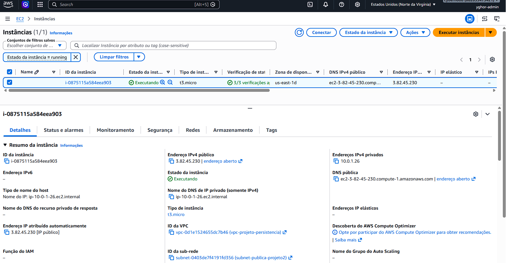
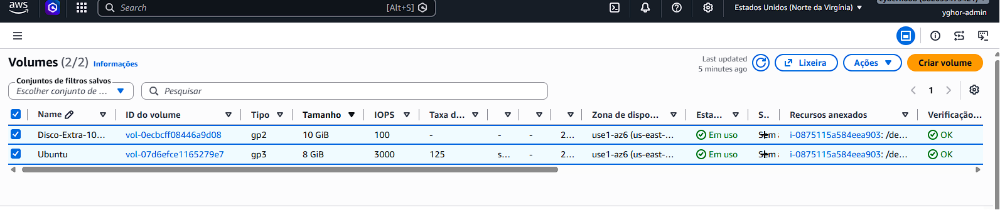

# 🏗️ AWS Cloud Infrastructure: Persistência Dinâmica & Portfólio Automatizado (Projeto Pessoal #1)

Este repositório marca o início dos meus **projetos pessoais focados no meu portfólio**, onde aplico conceitos de Cloud Computing e Infrastructure as Code (IaC) com o objetivo de consolidar minha especialização técnica em nuvem. 

O foco deste projeto foi desenvolver uma infraestrutura modularizada, escalável e segura na AWS utilizando variáveis dinâmicas, provisionamento automatizado de serviços e acoplamento de armazenamento persistente. Como diferencial prático, o servidor nasce 100% configurado com uma Landing Page profissional apresentando meu perfil, momento atual de carreira e objetivos de estudos na TI.

---

## 🎯 Objetivos Técnicos Concluídos

* **Modularização de Arquivos:** Divisão estrita de responsabilidades no Terraform (`providers.tf`, `variables.tf`, `main.tf`, `outputs.tf`).
* **Gerenciamento Dinâmico de Estados:** Uso de variáveis para flexibilizar parâmetros estruturais (regiões AWS, tipos de instâncias, tamanho do EBS e blocos de IPs seguros).
* **Armazenamento Persistente:** Criação de volumes independentes **AWS EBS** (gp3) e acoplamento dinâmico em instância EC2 rodando Ubuntu Server 24.04 LTS.
* **Automação de Provisionamento:** Utilização de `user_data` para atualização automática de pacotes, instalação do servidor Web Nginx e tratamento nativo de codificação de caracteres (UTF-8) direto no boot da máquina.
* **Segurança de Código:** Implementação do `.gitignore` contra vazamento de chaves privadas (`*.pem`) ou arquivos de estado sensíveis do Terraform (`*.tfstate`).

---

## 📂 Arquitetura e Estrutura de Arquivos

A organização do projeto:

| Arquivo | Descrição |
| :--- | :--- |
| `providers.tf` | Configura o bloco do Terraform e o provider da AWS, consumindo a região dinamicamente. |
| `variables.tf` | Centraliza todas as variáveis do projeto para maior reutilização de código. |
| `main.tf` | Provisiona VPC, Subnet, Internet Gateway, Tabela de Rotas, Security Group, Instância EC2, Volume EBS, Attachment e o script automatizado via `user_data`. |
| `outputs.tf` | Expõe no terminal os dados dinâmicos pós-deploy (IP Público da máquina, ID do Volume EBS e status do acoplamento). |
| `.gitignore` | Garante que dados de cache, travas locais e credenciais/estados não sejam enviados ao repositório público. |

---

## 🛠️ Tecnologias e Ferramentas Utilizadas

* **Provedor de Nuvem:** Amazon Web Services (AWS)
* **Serviços Utilizados:** EC2, EBS, VPC, Security Groups, Internet Gateway, Route Tables.
* **Ferramenta de IaC:** Terraform
* **Sistema Operacional:** Ubuntu Server 24.04 LTS
* **Servidor Web:** Nginx (HTML5/CSS3 integrado)

---

## 📊 Evidências do Projeto

Abaixo estão os registros visuais que validam a entrega da arquitetura proposta e o funcionamento do provisionamento.

### 🖥️ 1. Aplicação no Ar (Aba do Navegador)
A Landing Page foi executada de forma 100% automatizada no primeiro boot da instância através do script em `user_data`, tratando a codificação de caracteres nativos (UTF-8) para renderizar o perfil profissional, objetivos e emojis.


### ⚙️ 2. Console AWS: Instância EC2



### 💾 3. Console AWS: Painel de Volumes Persistentes (EBS)



---

## 🧹 Destruição de Recursos (Cost Control)

Para limpar o ambiente de testes na nuvem e evitar custos desnecessários no Free Tier da AWS, o comando de encerramento foi executado com sucesso:
     ```powershell
            terraform destroy -auto-approve

---

## 🚀 Como Rodar o Projeto

1. Certifique-se de ter o Terraform e o AWS CLI configurados localmente com suas credenciais.
2. Clone o repositório e navegue até a pasta do projeto.
3. Inicialize os providers do Terraform:
   ```powershell
   terraform init